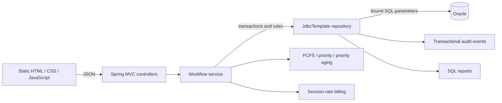

# Smart Parking Allocation System

A Java 25, Spring Boot, Spring JDBC, Oracle, and vanilla JavaScript academic project. It demonstrates parking allocation as a database-backed workflow, deterministic request scheduling, safe concurrent slot claims, versioned inventory edits, audit events, session billing, and operational reports.

This is a local learning prototype, not a production service. It has no authentication or authorization; do not expose it to an untrusted network.

## Architecture and current scope


```mermaid
flowchart LR
    UI[Static HTML / CSS / JavaScript] -->|JSON| C[Spring MVC controllers]
    C --> S[Workflow service]
    S -->|transactions and rules| R[JdbcTemplate repository]
    R -->|bound SQL parameters| O[(Oracle)]
    S --> SCH[FCFS / priority / priority aging]
    S --> BILL[Session-rate billing]
    R --> AUD[Transactional audit events]
    R --> REP[SQL reports]
```

Allocation is automatic and synchronous: submitting a request, releasing a session, adding an available slot, making a slot available, or starting the app causes it to assign as many compatible pending requests as it can. Automatic allocation uses priority aging. Requests without a matching free slot remain pending until one of those events makes allocation possible. There is no durable background worker queue or periodic retry worker. The existing concurrency unit test is a controlled Java-thread simulation using a mocked conditional database update; it is not an Oracle locking test.

## Requirements and configuration

- JDK 25
- Maven 3.9+
- Oracle Database with the included Oracle-compatible DDL (the SQL is written to remain compatible with Oracle 11g XE)

The application imports an optional, ignored root-level `application-local.properties`. Set a local Oracle password there, or provide it through `PARKING_DB_PASSWORD`. For example:

```properties
spring.datasource.password=your-local-password
```

Never commit the local properties file or put real credentials in documentation. The connection URL and username are defined in `src/main/resources/application.properties`; the hourly rate for new sessions is configured with `parking.billing.hourly-rate` (default `2.00`). New timestamps are stored as UTC Oracle `TIMESTAMP` values, and the connection session and JSON serialization use UTC. Browsers render those timestamps in the owner's local time zone.

Notification timing is configurable with `parking.notifications.upcoming-minutes` (default 15), `parking.notifications.unknown-reminder-minutes` (default 60), and `parking.notifications.poll-interval-ms` (default 60000).

The app requires one owner credential at startup: set `PARKING_OWNER_USERNAME` and `PARKING_OWNER_PASSWORD_HASH` (a BCrypt hash generated using Spring Security's `BCryptPasswordEncoder`). Only the hash is configured; there is no public registration endpoint or driver account. Spring Security provides the sign-in form, session handling, CSRF protection, and sign-out.

## Oracle setup and safe migration

The scripts are for different database states; do not run all of them:

1. **Brand-new empty schema:** run `src/main/resources/db/schema_fresh_oracle.sql` once. It creates the full current schema, constraints, sequences, and indexes.
2. **Existing legacy inventory schema:** if it has `PARKING_SLOTS` and `PARKING_SLOT_SEQ` but not the workflow tables, review and run `src/main/resources/db/phase1_oracle.sql` once to add the original workflow schema. Then review and run `src/main/resources/db/phase2_audit_locking_oracle.sql` once.
3. **Existing workflow schema already created from `phase1_oracle.sql`:** back up and inspect the schema, edit the `DEFAULT 2.00` in `phase2_audit_locking_oracle.sql` to match the hourly rate that was in force, then run phase 2 once.
4. **Existing schema already upgraded through phase 2:** back up and inspect the objects, then run `src/main/resources/db/phase3_time_notifications_oracle.sql` once. It adds expected-duration fields, out-of-service status, a unique active-vehicle guard, and persistent notifications. It adjusts status/audit check constraints without deleting records. Do not rerun it.
5. `src/main/resources/db/sample_data_oracle.sql` is an optional repeatable `MERGE` seed for its demo user and vehicle. It does not delete or overwrite records.

The earlier migrations add `PARKING_SLOTS.VERSION_NO`, rate/fee columns on sessions, audit objects, and report-supporting indexes. Review the rate default before migrating existing sessions. Back up first, inspect object names and existing constraints/indexes, and do not rerun one-time DDL. Never run the fresh-schema script over an existing database.

The application does not automatically create or migrate database objects. Oracle SQL was not executed as part of this work; verify the selected script against the actual schema before applying it.

## Backup and restore

Take an Oracle-consistent backup before applying any one-time migration. For an Oracle XE installation with Data Pump configured, an operator can use `expdp`/`impdp` against a dedicated directory object and an appropriately authorized account; keep passwords out of command history and source control. Validate the dump by restoring it into a separate test schema before relying on it. The application does not automate backups or restore procedures.

## Build, test, and run

```powershell
mvn test
mvn package
mvn spring-boot:run
```

Open `http://localhost:8080/`. Spring serves the dashboard from `src/main/resources/static/`. `/api/health` does not require Oracle; database-backed endpoints require the reviewed schema and the configured credentials. `/api/database/test` checks the Oracle connection.

## User workflow

1. Add inventory slots, or use existing slots in the database. The floor map groups slots by floor and offers search plus floor, vehicle-type, and status filters.
2. Register a driver record, then a vehicle of type `BIKE`, `CAR`, or `EV`. These are parking records, not app accounts.
3. Submit a request with priority `0`–`100` and an expected duration in minutes, or leave duration blank when it is unknown. A successful allocation creates an active session with a separately stored expected end time. The app immediately runs automatic allocation using priority aging.
4. Allocation picks the first available slot with an exact matching vehicle type. A successful allocation creates an active session; if no matching slot exists, the request stays pending. The owner dashboard displays expected end times and highlights sessions whose estimates have passed.
5. Use **Extend time** to add time to a session or **Confirm checkout** only after the vehicle leaves. An elapsed expected end creates a persistent notification but never frees the space. The slot remains occupied until checkout is confirmed. Unknown-duration sessions receive recurring reminders using the configured interval; those reminders do not claim the driver's time has expired.
6. The notification center retains acknowledged items and shows unread count. Notifications are deduplicated by event key, so repeated polling/restarts do not create another copy of the same event. Allocation creates an in-app notification; upcoming and expired estimates are processed on the configured timer.
7. Adding an available slot or changing a slot to `AVAILABLE` also triggers automatic allocation for waiting requests. On startup, the app checks whether waiting requests can now be assigned.
8. Review allocation history, recent audit events, and occupancy/revenue/allocation-outcome reports.

## Scheduling policies

- **FCFS:** earliest request timestamp, then lowest request ID.
- **PRIORITY:** highest submitted priority, then earliest timestamp, then lowest request ID.
- **PRIORITY_AGING:** effective priority is `min(100, basePriority + floor(max(waitMinutes, 0) / 5))`. Priority is bounded at 100. Equal effective priorities use earliest request timestamp, then lowest request ID. Aging is computed at scheduling time and does not change the stored base priority.

Automatic allocation uses `PRIORITY_AGING`. Explicit allocation API calls accept these policy strings in a request body; their existing `FCFS` default is preserved when the body or algorithm is omitted. `GET /api/parking/requests/scheduling/simulate` returns request ID orders under all three policies.

## Allocation, transactions, and concurrency

Each automatic allocation run is synchronous and runs in the triggering Spring JDBC transaction. A request is conditionally claimed only while `PENDING`; a candidate slot is conditionally updated only while `AVAILABLE`; session creation and allocation history/audit writes are in the same transaction. The database unique function-based index permits at most one active session per slot across application instances. Failed database writes roll back the related state changes and audit records. Oracle sequence values are non-transactional, so gaps after a rollback are normal.

Slot edits lock the slot row with `SELECT ... FOR UPDATE`, compare the submitted version, and update with `WHERE VERSION_NO=?` while incrementing the version. An edit with an old version returns HTTP 409 instead of silently overwriting a newer edit. The status dashboard sends the version it loaded; API clients must do the same for slot `PUT` and status `PATCH`.

The `ParkingSlotClaimConcurrencyTest` starts competing Java executor tasks against an atomic mock of the repository's conditional claim and verifies one winner. This is a **simulated contract test**, not evidence that Oracle locking was exercised. Oracle-backed race/rollback tests require a dedicated test database and are not included or claimed here.

## Audit and reporting

Audit events cover slot create/edit/status/delete, request creation, allocation attempts (including `NO_SLOT`), and session release. Event rows include event type/time, related request/session/slot IDs where applicable, outcome, and before/after or billing details. They are inserted in the transaction of the operation they describe. Audit rows intentionally do not use foreign keys to entities such as slots so that a slot deletion does not erase its audit history.

`GET /api/parking/audit?limit=50` returns the newest events; `limit` must be between 1 and 200.

`GET /api/parking/reports?from=2026-10-01&to=2026-10-31` returns:

- Daily occupancy snapshots and utilization percentage. Historical days are sampled at midnight at the end of the day; the current day is sampled at query time. Utilization divides by the current slot inventory, so it is a current-capacity comparison rather than a reconstruction of past inventory.
- Daily revenue and closed-session counts grouped by session end date. Stored billed fees are used when present; migrated pre-existing sessions use the stored hourly-rate snapshot and billing formula as a fallback.
- Daily allocation attempt counts grouped by `ALLOCATED` / `NO_SLOT`.

Dates are inclusive, default to the most recent 30 days through today, may not extend into the future, and are limited to 366 days. The report queries use bound parameters. The schema includes indexes for the report date filters and recent audit-event ordering. No performance gain is claimed or measured.

For Oracle plan inspection, use the same query shape and representative bind values in a test/schema environment:

```sql
EXPLAIN PLAN FOR
SELECT SESSION_ID, ENDED_AT
FROM PARKING_SESSIONS
WHERE SESSION_STATUS = 'CLOSED'
  AND ENDED_AT >= TIMESTAMP '2026-10-01 00:00:00'
  AND ENDED_AT <  TIMESTAMP '2026-11-01 00:00:00';

SELECT * FROM TABLE(DBMS_XPLAN.DISPLAY);
```

`EXPLAIN PLAN` records a plan in Oracle's plan table; it is not a runtime benchmark. Check privileges and use `DBMS_XPLAN.DISPLAY_CURSOR` with actual cursor statistics when an execution-level plan is needed.

## API reference

All bodies are JSON unless noted. Slot statuses are `AVAILABLE`, `OCCUPIED`, `RESERVED`, and `OUT_OF_SERVICE`. Slot and vehicle types are `BIKE`, `CAR`, and `EV`.

### Health and inventory

| Method and path | Behavior |
|---|---|
| `GET /api/health` | Application health string; no database query |
| `GET /api/database/test` | Oracle connectivity check |
| `GET /api/parking/stats` | Total/available/occupied/reserved/out-of-service counts and overdue sessions |
| `GET /api/parking/slots?status=AVAILABLE&floor=0&vehicleType=CAR&search=C-01` | Filtered floor-map slots, including active vehicle and expected end |
| `GET /api/parking/slots/{id}` | Slot detail and version |
| `POST /api/parking/slots` | Create slot; status defaults to `AVAILABLE` |
| `PUT /api/parking/slots/{id}` | Edit slot using the currently loaded `version` |
| `PATCH /api/parking/slots/{id}/status` | Change status using the currently loaded `version` |
| `DELETE /api/parking/slots/{id}` | Delete only if no session history references the slot |

Example:

```json
POST /api/parking/slots
{
  "slotNumber": "C-01",
  "floor": 0,
  "slotType": "CAR",
  "status": "AVAILABLE"
}
```

Slot updates require a `version`, returned by slot reads. A version 0 edit increments it to 1:

```json
PUT /api/parking/slots/7
{
  "slotNumber": "C-07",
  "floor": 0,
  "slotType": "CAR",
  "status": "AVAILABLE",
  "version": 0
}
```

Status changes use `{"status":"RESERVED","version":1}`. A stale version returns 409 and asks the caller to refresh.

### Users, vehicles, requests, sessions

| Method and path | Behavior |
|---|---|
| `GET /api/parking/users`, `POST /api/parking/users` | List/register a user |
| `GET /api/parking/vehicles`, `POST /api/parking/vehicles` | List/register a vehicle |
| `GET /api/parking/requests`, `POST /api/parking/requests` | List/create a request; creating one triggers automatic allocation |
| `GET /api/parking/requests/{id}` | Request detail |
| `POST /api/parking/requests/{id}/allocate` | Allocate a specific request only if it is next eligible under the policy |
| `POST /api/parking/requests/allocate-next` | Allocate the next compatible pending request |
| `GET /api/parking/requests/scheduling/simulate` | Compare FCFS, fixed priority, and aging order |
| `GET /api/parking/sessions/active` | Active sessions with estimated fees |
| `GET /api/parking/sessions/{id}` | Session details and estimated/final fee |
| `POST /api/parking/sessions/{id}/release` | Close session, free slot, persist billed fee, then automatically allocate waiting requests |
| `POST /api/parking/sessions/{id}/extend` | Extend expected end time by `{"additionalMinutes":30}`; an unknown end becomes known |
| `GET /api/parking/notifications?unreadOnly=false&offset=0&limit=50` | Paginated persistent notifications and unread count |
| `POST /api/parking/notifications/{id}/acknowledge` | Acknowledge a notification without deleting its history |
| `GET /api/parking/history` | Allocation attempts and session history |
| `GET /api/parking/audit?limit=50` | Recent audit events; limit 1–200 |
| `GET /api/parking/reports?from=YYYY-MM-DD&to=YYYY-MM-DD` | Occupancy, revenue, and allocation outcomes |

Example registration and automatic allocation:

```json
POST /api/parking/users
{ "fullName": "Demo Driver", "phone": "555-0100" }

POST /api/parking/vehicles
{ "userId": 1, "registrationNumber": "ABC-123", "vehicleType": "CAR" }

POST /api/parking/requests
{ "vehicleId": 1, "priority": 20, "expectedDurationMinutes": 120 }
```

Creating the request automatically runs allocation using `PRIORITY_AGING`. The create response contains the request details and an `automaticAllocations` array with any requests assigned during that run. Omit or set `expectedDurationMinutes` to `null` for an unknown duration. Valid estimates are 1–10080 minutes. The explicit `allocate-next` and per-request allocation endpoints remain available to API clients.

Successful allocation returns `allocated`, `requestId`, `sessionId`, `slot`, and `algorithm`. Release returns `durationSeconds`, `chargedHours`, `hourlyRate`, and `fee`. Any positive partial hour rounds up; a zero-duration session is free.

Example allocation response:

```json
{
  "allocated": true,
  "requestId": 14,
  "sessionId": 22,
  "slot": { "id": 7, "slotNumber": "C-01", "floor": 0, "slotType": "CAR" },
  "algorithm": "PRIORITY_AGING"
}
```

The scheduling comparison response has `fcfs`, `priority`, and `priorityAging` arrays of request IDs. Reports return `from`, `to`, `occupancy`, `revenue`, and `allocationOutcomes`; each daily occupancy row includes occupied/total slot counts and `utilizationPercent`.

### Validation and errors

Invalid input returns HTTP 400, missing records HTTP 404, and stale versions, already-processed requests, uniqueness failures, scheduling conflicts, or unavailable compatible slots HTTP 409. Errors use Spring's HTTP error response with a useful `detail` when available. Request priority is 0–100; user names, phone values, registration numbers, slot numbers, floor values, and policy names are checked at the API boundary.

## Database model and OS/DBMS concepts

- **Operating systems:** FCFS and non-preemptive priority scheduling, bounded priority aging, deterministic tie-breaking, and a barrier-coordinated multi-thread contention simulation.
- **DBMS:** normalized users/vehicles/requests/sessions/history, Oracle sequences and constraints, bound SQL parameters, transactions, `SELECT ... FOR UPDATE`, compare-and-increment optimistic versions, conditional updates, a function-based unique index, audit trail, aggregate reports, and query-plan inspection.
- **Billing:** session rate is captured at allocation; release computes and persists the final fee, so later rate configuration changes do not rewrite recorded revenue.

Automatic allocation runs when the app starts, creates a request, releases a session, or adds/makes available a slot. Expired expected times never alter slot status; only the owner checkout action does. The notification timer is an in-process Spring scheduled task, not a persisted worker pool, so it may be delayed while the application is stopped and is not a substitute for durable distributed job processing. Reservations/no-show handling, configurable scheduling policy selection, allocation explanations, and persistent OS worker queues are not implemented. This remains a local learning prototype; do not expose it to an untrusted network.

## Tests and verification limits

The Maven test suite covers FCFS/fixed-priority ordering, aging and deterministic ties, billing rounding/invalid intervals, expected-time extension, expiration notification wording, notification event-key deduplication behavior, slot validation and optimistic stale-version conflicts, existing endpoint contracts, and the simulated competing slot claim. The repository has no configured Oracle integration-test profile or dedicated test database. Do not point tests at a production or unknown database. GitHub Actions runs `mvn test` and `mvn package` on pushes and pull requests.

No Oracle setup/migration, live endpoint workflow, Oracle row-locking race, or audit rollback was exercised without a configured test database. Database-specific DDL and SQL must be validated against the target Oracle version/schema before deployment.

## Troubleshooting

- Connection refused: confirm Oracle is running at the configured JDBC URL and the service name is correct.
- Authentication failure: check local `application-local.properties` or `PARKING_DB_PASSWORD`; do not commit credentials.
- Missing table/column/sequence: review schema state and apply only the correct one-time setup/migration.
- `ORA-00001` on allocation: the unique active-slot constraint prevented conflicting claims; refresh request/slot state.
- HTTP 409 on slot edit: reload slots and resubmit using the latest version.
- HTTP 409 on allocation: another request may be ahead under the selected policy, or no compatible slot remains.
- Reports empty for revenue: only closed sessions contribute; reports group revenue by session end date.
